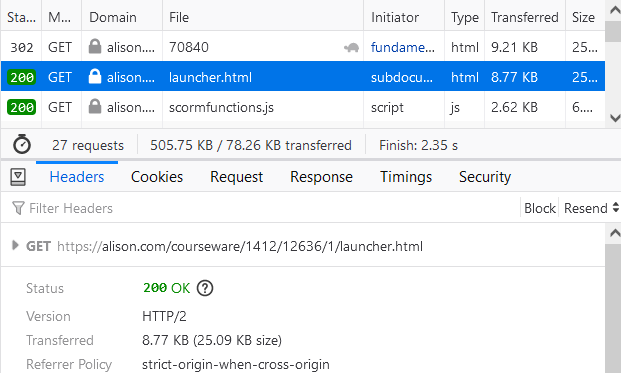

# Alison Web Scraping
This Script is useful for scraping the modules of alison.com and get the content in a text file.

# Steps to run script

- Install node depndencies

```powershell
npm insatll
```

- Start the Module you want to scrape and open network tools, find the below request and copy the get request url.



### In the index.js change the following values

- Change the var url value to the above, GET request value
```jsx
// Example https://alison.com/courseware/1786/14437/1/1.html
var url = "https://alison.com/courseware/1786/14437/1/1.html"
```

```jsx
const filepath = './html/10_Modules.txt';
```

```jsx
const no_of_sub_modules = 6
// This array maps no of pages in each sub module
const max_index = [0, 1, 30, 30, 30, 30, 30];
```
